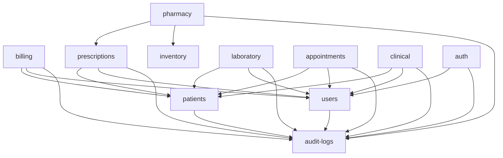

# Healthcare ERP Backend — Module Boundaries, Ownerships & Dependency Rules

This document establishes the official domain taxonomy, data ownership boundaries, permitted dependency directions, and inter-module communication protocols for the **Healthcare ERP Backend** Modular-Monolith.

---

## 1. Domain Taxonomy & Boundaries

The ERP system is divided into five core domain groups:

```
┌─────────────────────────────────────────────────────────────────────────────┐
│                           1. Identity & Governance                          │
│                      [auth]        [users]        [roles]                   │
└───────────────────────────────────────┬─────────────────────────────────────┘
                                        │
┌───────────────────────────────────────▼─────────────────────────────────────┐
│                      2. Master Patient Index & Records                      │
│                                  [patients]                                 │
└───────────────────────────────────────┬─────────────────────────────────────┘
                                        │
┌───────────────────────────────────────▼─────────────────────────────────────┐
│                     3. Clinical & Care Delivery Domains                     │
│               [appointments]    [clinical]    [prescriptions]               │
└───────────────────────────────────────┬─────────────────────────────────────┘
                                        │
┌───────────────────────────────────────▼─────────────────────────────────────┐
│                   4. Operations, Pharmacy & Diagnostics                     │
│                  [pharmacy]    [inventory]    [laboratory]                  │
└───────────────────────────────────────┬─────────────────────────────────────┘
                                        │
┌───────────────────────────────────────▼─────────────────────────────────────┐
│                   5. Revenue Cycle, Billing & Invoicing                     │
│                            [billing]    [insurance]                         │
└─────────────────────────────────────────────────────────────────────────────┘
                                        │
┌───────────────────────────────────────▼─────────────────────────────────────┐
│                      6. Cross-Cutting Infrastructure                        │
│                     [audit-logs]        [notifications]                     │
└─────────────────────────────────────────────────────────────────────────────┘
```

---

## 2. Domain Ownership Matrix

Every database table, business rule, and data mutation is owned exclusively by **one** domain module. No module may directly query or modify tables owned by another domain.

| Domain Module | Primary Models Owned | Source of Truth For | Public Service Contract (`*.service.ts`) |
|---|---|---|---|
| **`auth`** | Token sessions, Refresh tokens, Password resets | Authentication lifecycle, JWT issuance/revocation | `authService.verifyToken()`, `authService.login()` |
| **`users`** | `User`, `Role`, `UserProfile` | Staff accounts, staff credentials, roles, departments | `userService.getUserById()`, `userService.listUsers()` |
| **`patients`** | `Patient`, `PatientEmergencyContact`, `PatientAllergy` | Patient demographics, contact info, medical background | `patientService.getPatientById()`, `patientService.search()` |
| **`appointments`** | `Appointment`, `DoctorSchedule`, `QueueEntry` | Doctor availability, consultation scheduling, queue status | `appointmentService.createAppointment()`, `appointmentService.getSchedule()` |
| **`clinical`** | `MedicalRecord`, `ConsultationNote`, `Diagnosis` | Clinical notes, patient encounters, diagnoses (ICD-10) | `clinicalService.recordEncounter()`, `clinicalService.getPatientHistory()` |
| **`prescriptions`** | `Prescription`, `PrescriptionItem` | Medication orders, dosages, doctor instructions | `prescriptionService.createPrescription()`, `prescriptionService.getPending()` |
| **`pharmacy`** | `MedicationCatalog`, `DispensationRecord` | Drug inventory, dispensing, dosage forms, batch numbers | `pharmacyService.dispensePrescription()`, `pharmacyService.checkStock()` |
| **`laboratory`** | `LabTest`, `LabOrder`, `LabResult`, `Specimen` | Diagnostic test catalog, specimen tracking, lab results | `labService.orderTest()`, `labService.recordResults()` |
| **`inventory`** | `Item`, `StockLevel`, `Supplier`, `PurchaseOrder` | Medical supplies, non-drug assets, stock movements | `inventoryService.deductStock()`, `inventoryService.reorderAlert()` |
| **`billing`** | `Invoice`, `InvoiceItem`, `Payment`, `Claim` | Invoicing, payments, charge capture, fee schedules | `billingService.createInvoice()`, `billingService.processPayment()` |
| **`audit-logs`** | `AuditLog` | Immutable HIPAA/compliance event audit logs | `auditLogRepository.create()` |
| **`notifications`** | `NotificationTemplate`, `NotificationLog` | SMS, email, in-app alerts (appointment reminders, results) | `notificationService.send()` |

---

## 3. Public Module API Pattern (`index.ts` Barrels)

To prevent uncontrolled deep imports and enforce loose coupling, every domain module must expose a single **Public API** entrypoint via `src/modules/<domain>/index.ts`.

### Public vs Private Module Surface

```
src/modules/patients/
├── index.ts              # [PUBLIC API] (Only exports Service, Route, Public DTOs)
├── patient.service.ts    # [PUBLIC] (Exported via index.ts)
├── patient.dto.ts        # [PUBLIC] (Exported via index.ts)
├── patient.route.ts      # [PUBLIC] (Exported via index.ts for main router)
├── patient.controller.ts # [PRIVATE INTERNAL] (Never exported)
└── patient.repository.ts # [PRIVATE INTERNAL] (Never exported)
```

### Import Rules:
```ts
// [CORRECT]: Import from the public module entrypoint
import { patientService, type PatientResponseDto } from '@/modules/patients'

// [FORBIDDEN]: Deep-importing internal module files
import { patientRepository } from '@/modules/patients/patient.repository'
import { patientController } from '@/modules/patients/patient.controller'
```

---

## 4. Shared-Kernel Responsibilities & Common Utility Boundaries

### What Belongs in `src/shared/`?
The **Shared Kernel** contains cross-cutting, domain-agnostic infrastructure, contracts, and pure functions:
1. **Domain Event Bus (`src/shared/events/event-bus.ts`)**: Type-safe pub/sub broker for asynchronous side-effects between domains.
2. **HTTP Response Envelopes (`src/shared/utils/response.util.ts`)**: Standard JSON envelope formatting (`sendSuccess`, `sendPaginated`, `sendCreated`, `sendNoContent`).
3. **Global Type Contracts (`src/shared/types/`)**: Shared pagination schemas (`pagination.type.ts`), request context types.
4. **Pure Common Utilities (`src/shared/utils/`)**: Stateless helper functions (e.g. date formatters, string manipulators, cryptographic helpers).

### Shared Kernel Boundary Rules:
- **Zero Domain Imports**: Code in `src/shared/`, `src/config/`, or `src/db/` must **NEVER** import from `src/modules/`.
- **Stateless & Pure**: Utility functions must be deterministic, pure, and have no hidden database side-effects.
- **No Business Rules**: Domain logic, tax calculations, clinical triage rules, or workflow orchestrations must **never** live in `src/shared/`.

---

## 5. Dependency Rules & Graph

Modules must follow a strict **unidirectional dependency hierarchy**.



### Dependency Rules:

1. **Upstream vs Downstream Direction**:
   - Master data domains (`users`, `patients`, `audit-logs`) are **Upstream**.
   - Transactional domains (`appointments`, `clinical`, `prescriptions`, `pharmacy`, `billing`) are **Downstream**.
   - Downstream domains may depend on Upstream domains.
   - **Upstream domains must NEVER depend on Downstream domains** (e.g. `patients` must never import `billing` or `prescriptions`).

2. **Strictly Prohibited Cross-Domain Direct DB Access**:
   - Module A must **NEVER** import Module B's Prisma Repository or execute queries on Module B's tables.
   - If `billing` needs patient details, it must call `patientService.getPatientById(patientId)`.

3. **No Circular Dependencies**:
   - Circular imports ($A \rightarrow B \rightarrow A$) are strictly forbidden and blocked by automated checks.

4. **Independent Domain Testing**:
   - Every domain's Application Service must accept injected dependencies (`IUserRepository`, `IPatientRepository`, `IAuditLogRepository`, `EventBus`) for fast, isolated in-memory unit testing.

---

## 6. Automated Architectural Boundary Enforcement

To prevent architectural drift and accidental boundary violations, an automated static analyzer is integrated into the build pipeline:

```sh
# Run boundary check manually:
bun run check:boundaries
```

### Rules Checked by `scripts/check-boundaries.ts`:
1. `NO_DEEP_MODULE_IMPORTS`: Flags any file importing another module's internal sub-files instead of `@/modules/<domain>`.
2. `SHARED_KERNEL_ISOLATION`: Flags any file in `src/shared/`, `src/config/`, or `src/db/` that attempts to import from `src/modules/`.
3. `UPSTREAM_DEPENDS_ON_DOWNSTREAM`: Flags any upstream master data module attempting to import transactional downstream modules.

> The boundary check runs automatically during `bun run build` and will fail the build if violations are detected.
